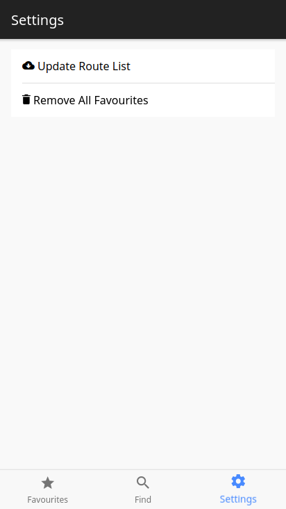

simpletransit
===

Simple TTC transit app 

## Features

* Add frequent stops as favorites
* In app update of routes and 
* Get real time predictions by SMS messages

## Screenshots

### Favourites

### Search

Page where you can search for a route

 
### Search
 
Settings page lets you update the list of routes

### Search Update
 
Always be up to date with the latest routes

